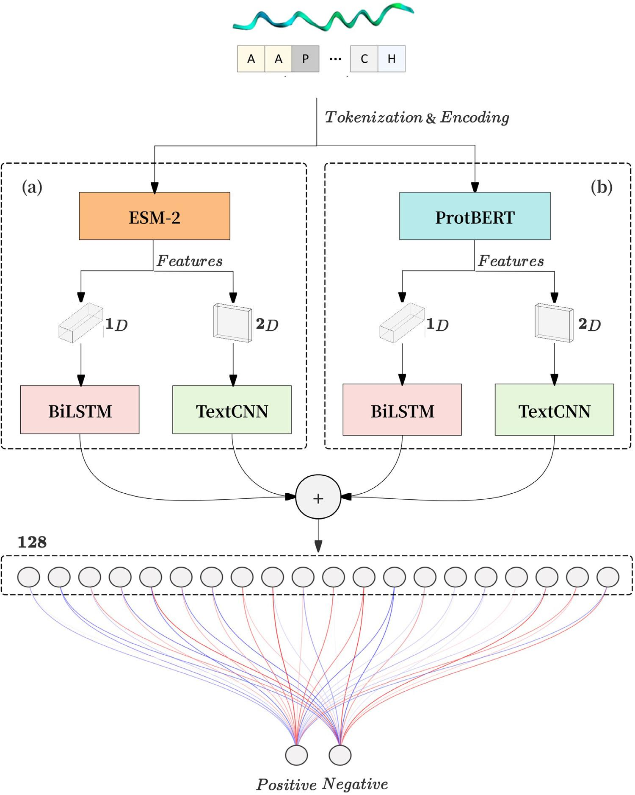

# DeepTree-AAPred

Code and datasets for **DeepTree-AAPred: Binary tree-based deep learning model for anti-angiogenic peptides prediction**.

## Paper

- Title: DeepTree-AAPred: Binary tree-based deep learning model for anti-angiogenic peptides prediction
- Authors: Fan Zhang, Jinfeng Li, Chun Fang
- Journal: Journal of Molecular Graphics and Modelling, 137, 108982, 2025
- DOI: https://doi.org/10.1016/j.jmgm.2025.108982

## Overview

DeepTree-AAPred predicts anti-angiogenic peptides (AAPs) using a binary tree-style feature extraction model. The model combines protein language model representations from ProtBERT and ESM with BiLSTM and TextCNN branches, then fuses the extracted features for binary classification.



Figure source: Zhang et al., "DeepTree-AAPred: Binary tree-based deep learning model for anti-angiogenic peptides prediction," Journal of Molecular Graphics and Modelling, 2025.

## Repository Contents

- `tree.py`: main independent-test training script for the curated AAP dataset.
- `tree-5fold.py`: 5-fold cross-validation training script.
- `data/aap/AAIP_135.csv`: processed 15-residue training dataset.
- `data/aap/AAIP_28.csv`: processed 15-residue independent test dataset.
- `data/aap/original/`: original AAP dataset CSV files before 15-residue preprocessing.
- `requirements.txt`: Python dependency list.

## Large Model Files

The original working directory used local pretrained model folders:

- `protbert/`
- `protbert_bfd/`
- `ESM/` or another local ESM model path, depending on the script

These pretrained weights are several gigabytes and are intentionally not committed to Git. Download the corresponding models separately, then place them at the paths expected by the scripts or update the `from_pretrained(...)` paths in code.

Common model sources include:

- ProtBERT: `Rostlab/prot_bert`
- ProtBERT-BFD: `Rostlab/prot_bert_bfd`
- ESM-2: Meta/Facebook ESM model checkpoints on Hugging Face

## Installation

Create an environment with Python 3 and install the main dependencies:

```bash
pip install -r requirements.txt
```

RDKit is often easier to install with conda:

```bash
conda install -c conda-forge rdkit
```

## Usage

Prepare local pretrained model directories first, then run the independent-test experiment:

```bash
python tree.py
```

For 5-fold cross validation:

```bash
python tree-5fold.py
```

The scripts expect to be run from the repository root so relative dataset paths such as `data/aap/AAIP_135.csv` can be resolved.

## Notes

This repository keeps the core training scripts and paper-related AAP datasets. Large pretrained model weights, runtime checkpoints, temporary notebooks, and exploratory scripts are intentionally excluded.
